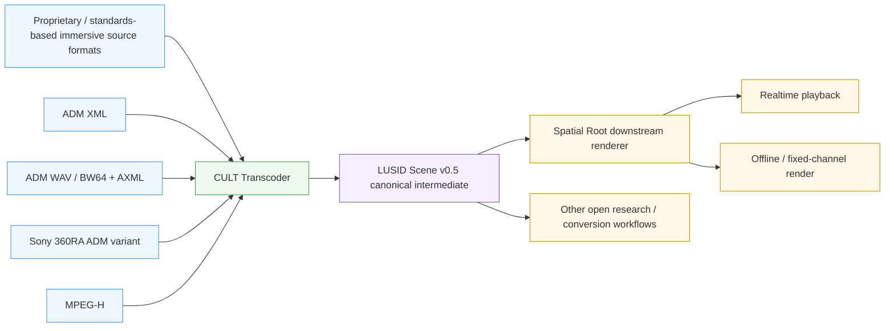

# System Context

```mermaid
flowchart LR
    A[Proprietary / standards-based immersive source formats] --> B[CULT Transcoder]
    B --> C[LUSID Scene v0.5 canonical intermediate]
    C --> D[Spatial Root downstream renderer]
    C --> E[Other open research / conversion workflows]

    F[ADM XML] --> B
    G[ADM WAV / BW64 + AXML] --> B
    H[Sony 360RA ADM variant] --> B
    I[MPEG-H] --> B

    D --> J[Realtime playback]
    D --> K[Offline / fixed-channel render]

    classDef src fill:#eef7ff,stroke:#4a90e2,stroke-width:1px;
    classDef core fill:#eefaf0,stroke:#43a047,stroke-width:1px;
    classDef canon fill:#f5f0ff,stroke:#7e57c2,stroke-width:1px;
    classDef out fill:#fff8e8,stroke:#c49000,stroke-width:1px;

    class A,F,G,H,I src;
    class B core;
    class C canon;
    class D,E,J,K out;
```
