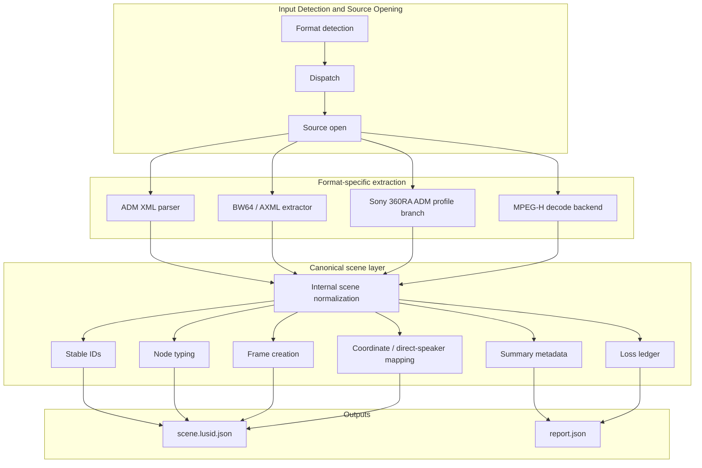

# Core Systems Architecture

```mermaid
flowchart TB
    subgraph InputLayer[Input Detection and Source Opening]
        D1[Format detection]
        D2[Dispatch]
        D3[Source open]
    end

    subgraph DomainReaders[Format-specific extraction]
        A1[ADM XML parser]
        A2[BW64 / AXML extractor]
        A3[Sony 360RA ADM profile branch]
        A4[MPEG-H decode backend]
    end

    subgraph CanonicalCore[Canonical scene layer]
        C1[Internal scene normalization]
        C2[Stable IDs]
        C3[Node typing]
        C4[Frame creation]
        C5[Coordinate / direct-speaker mapping]
        C6[Summary metadata]
        C7[Loss ledger]
    end

    subgraph OutputLayer[Outputs]
        O1[scene.lusid.json]
        O2[report.json]
    end

    D1 --> D2 --> D3
    D3 --> A1
    D3 --> A2
    D3 --> A3
    D3 --> A4

    A1 --> C1
    A2 --> C1
    A3 --> C1
    A4 --> C1

    C1 --> C2
    C1 --> C3
    C1 --> C4
    C1 --> C5
    C1 --> C6
    C1 --> C7

    C2 --> O1
    C3 --> O1
    C4 --> O1
    C5 --> O1
    C6 --> O2
    C7 --> O2
```
