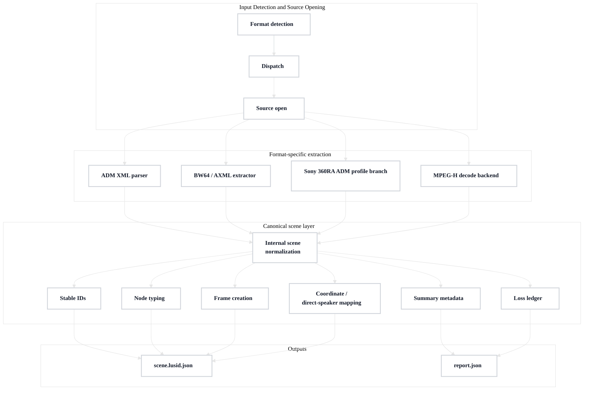

# Core Systems Architecture

```mermaid
%%{init: {"theme":"base","themeVariables": {"background":"#ffffff","primaryColor":"#ffffff","secondaryColor":"#ffffff","tertiaryColor":"#ffffff","primaryTextColor":"#111827","edgeLabelBackground":"#ffffff","lineColor":"#e6e6e6","fontFamily":"Inter, Arial, sans-serif","fontSize":"14px"}}}%%
flowchart TB
    %% layout groups with some spacing hints
    subgraph InputLayer["Input Detection and Source Opening"]
        direction TB
        D1["Format detection"]
        D2["Dispatch"]
        D3["Source open"]
    end

    subgraph DomainReaders["Format-specific extraction"]
        direction TB
        A1["ADM XML parser"]
        A2["BW64 / AXML extractor"]
        A3["Sony 360RA ADM profile branch"]
        A4["MPEG-H decode backend"]
    end

    subgraph CanonicalCore["Canonical scene layer"]
        direction TB
        C1["Internal scene\nnormalization"]
        C2["Stable IDs"]
        C3["Node typing"]
        C4["Frame creation"]
        C5["Coordinate /\ndirect-speaker mapping"]
        C6["Summary metadata"]
        C7["Loss ledger"]
    end

    subgraph OutputLayer["Outputs"]
        direction TB
        O1["scene.lusid.json"]
        O2["report.json"]
    end

    %% connections
    D1 --> D2 --> D3
    D3 --> A1
    D3 --> A2
    D3 --> A3
    D3 --> A4

    A1 --> C1
    A2 --> C1
    A3 --> C1
    A4 --> C1

    C1 --> C2
    C1 --> C3
    C1 --> C4
    C1 --> C5
    C1 --> C6
    C1 --> C7

    C2 --> O1
    C3 --> O1
    C4 --> O1
    C5 --> O1
    C6 --> O2
    C7 --> O2

    %% clean, white node styles
    classDef groupTitle fill:#ffffff,stroke:none,color:#111827,font-weight:700,font-size:15px,text-align:center
    classDef inputNode fill:#ffffff,stroke:#d1d5db,stroke-width:2px,color:#111827,font-weight:700
    classDef domainNode fill:#ffffff,stroke:#d1d5db,stroke-width:2px,color:#111827,font-weight:700
    classDef coreNode fill:#ffffff,stroke:#d1d5db,stroke-width:2px,color:#111827,font-weight:700
    classDef outputNode fill:#ffffff,stroke:#d1d5db,stroke-width:2px,color:#111827,font-weight:700

    %% subgraph titles are handled by Mermaid (bracketed labels)
    class D1,D2,D3 inputNode
    class A1,A2,A3,A4 domainNode
    class C1,C2,C3,C4,C5,C6,C7 coreNode
    class O1,O2 outputNode

    %% subtle link styling
    linkStyle default stroke:#e6e6e6,stroke-width:1px
    linkStyle 0 stroke:#cfd8dc,stroke-width:1px
```
