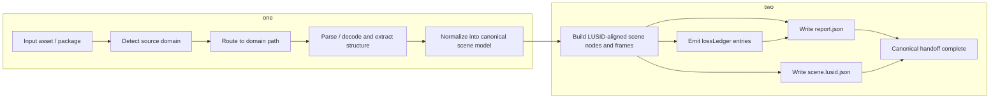

# Transcoding Data Flow

```mermaid
flowchart LR

    subgraph one
        direction LR
        IN[Input asset / package] --> DETECT[Detect source domain]
        DETECT --> DISPATCH[Route to domain path]
        DISPATCH --> EXTRACT[Parse / decode and extract structure]
        EXTRACT --> NORMALIZE[Normalize into canonical scene model]
    end

    subgraph two
        direction LR
        NORMALIZE --> BUILD[Build LUSID-aligned scene nodes and frames]
        BUILD --> EXPORT1[Write scene.lusid.json]
        BUILD --> EXPORT2[Write report.json]
        BUILD --> LOSS[Emit lossLedger entries]
        EXPORT2 --> DONE[Canonical handoff complete]
        EXPORT1 --> DONE
        LOSS --> EXPORT2
    end

```
