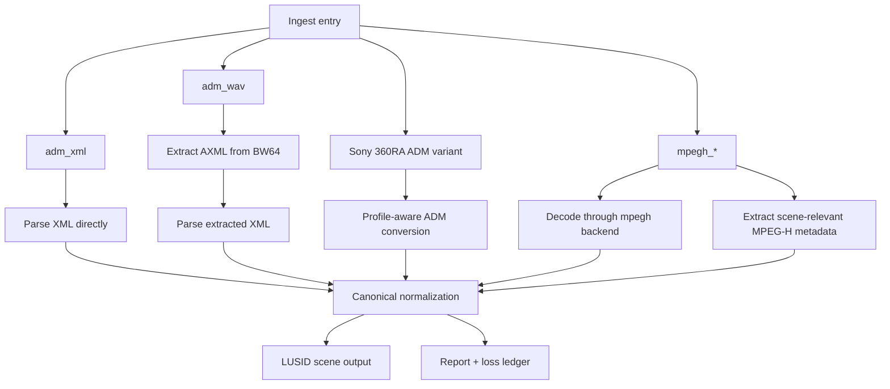
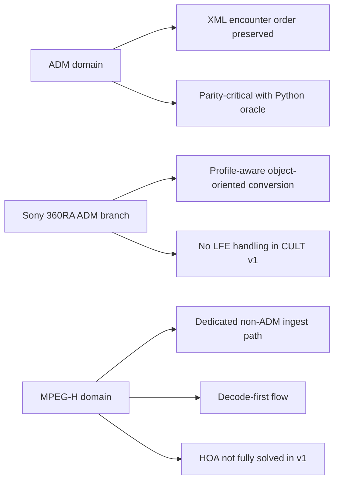

# Format Ingest Paths

```mermaid
flowchart TB
    ROOT[Ingest entry] --> ADMXML[adm_xml]
    ROOT --> ADMWAV[adm_wav]
    ROOT --> SONYADM[Sony 360RA ADM variant]
    ROOT --> MPEGH[mpegh_*]

    ADMXML --> P1[Parse XML directly]
    ADMWAV --> P2[Extract AXML from BW64]
    P2 --> P3[Parse extracted XML]
    SONYADM --> P4[Profile-aware ADM conversion]
    MPEGH --> P5[Decode through mpegh backend]
    MPEGH --> P6[Extract scene-relevant MPEG-H metadata]

    P1 --> N[Canonical normalization]
    P3 --> N
    P4 --> N
    P5 --> N
    P6 --> N

    N --> L[LUSID scene output]
    N --> R[Report + loss ledger]
```

```mermaid
flowchart LR
    A[ADM domain] --> B[XML encounter order preserved]
    A --> C[Parity-critical with Python oracle]
    D[Sony 360RA ADM branch] --> E[Profile-aware object-oriented conversion]
    D --> F[No LFE handling in CULT v1]
    G[MPEG-H domain] --> H[Dedicated non-ADM ingest path]
    G --> I[Decode-first flow]
    G --> J[HOA not fully solved in v1]
```
