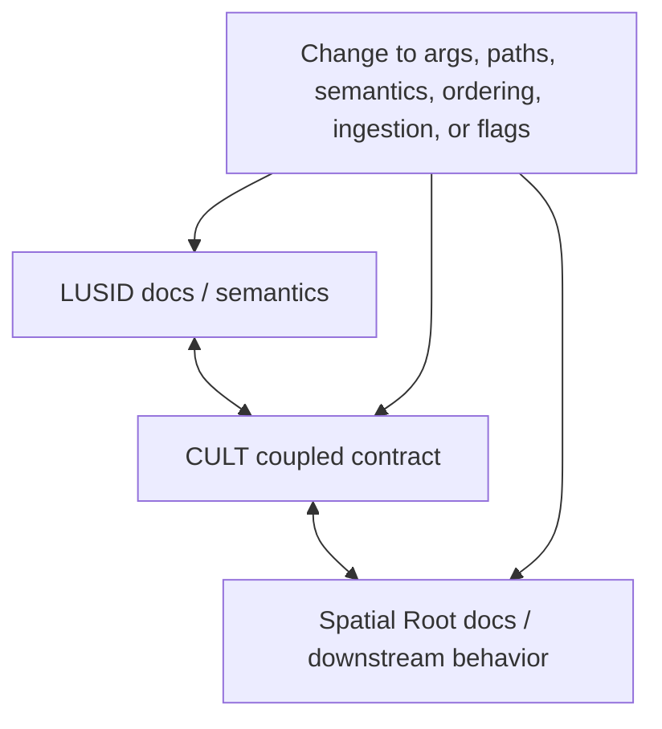

# Toolchain Boundaries

```mermaid
flowchart LR
    subgraph Upstream[Upstream responsibilities outside CULT]
        U1[Source format authoring]
        U2[Codec/container production]
    end

    subgraph CULT[CULT owns]
        C1[Input detection and dispatch]
        C2[Format-specific metadata extraction]
        C3[Canonical scene normalization]
        C4[Profile-aware conversion]
        C5[Canonical export]
        C6[Reporting and loss ledger]
    end

    subgraph Canonical[Canonical handoff]
        H1[LUSID Scene v0.5]
        H2[report.json]
    end

    subgraph Downstream[Downstream responsibilities outside CULT]
        D1[Spatial Root realtime playback]
        D2[Layout-specific rendering]
        D3[Offline / fixed-channel rendering]
        D4[Bass management]
        D5[Venue-specific render policy]
    end

    Upstream --> CULT --> Canonical --> Downstream
```

```mermaid
flowchart TB
    LUSID[LUSID docs / semantics] <--> CULTDOC[CULT coupled contract]
    CULTDOC <--> ROOTDOC[Spatial Root docs / downstream behavior]

    CHANGE[Change to args, paths, semantics, ordering, ingestion, or flags] --> CULTDOC
    CHANGE --> LUSID
    CHANGE --> ROOTDOC
```
