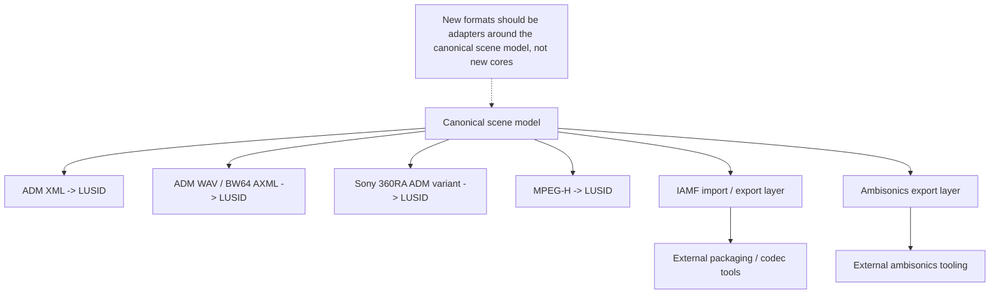

# Extensibility and Roadmap

```mermaid
flowchart TB
    CORE[Canonical scene model] --> V1A[ADM XML -> LUSID]
    CORE --> V1B[ADM WAV / BW64 AXML -> LUSID]
    CORE --> V1C[Sony 360RA ADM variant -> LUSID]
    CORE --> V1D[MPEG-H -> LUSID]

    CORE --> V2A[IAMF import / export layer]
    CORE --> V2B[Ambisonics export layer]

    V2A --> EXT1[External packaging / codec tools]
    V2B --> EXT2[External ambisonics tooling]

    NOTE[New formats should be adapters around the canonical scene model, not new cores]
    NOTE -.-> CORE
```
