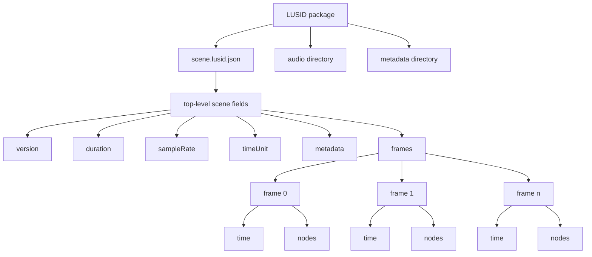

# LUSID Scene Graph Diagram

## Current scene graph shape

```mermaid
flowchart TB
    PKG[LUSID package]
    PKG --> SCENE[scene.lusid.json]
    PKG --> AUDIO[audio directory]
    PKG --> META[metadata directory]

    SCENE --> TOP[top-level scene fields]
    TOP --> V[version]
    TOP --> D[duration]
    TOP --> SR[sampleRate]
    TOP --> TU[timeUnit]
    TOP --> MD[metadata]
    TOP --> FR[frames]

    FR --> F0[frame 0]
    FR --> F1[frame 1]
    FR --> FN[frame n]

    F0 --> T0[time]
    F0 --> N0[nodes]

    F1 --> T1[time]
    F1 --> N1[nodes]

    FN --> TN[time]
    FN --> NN[nodes]
```
