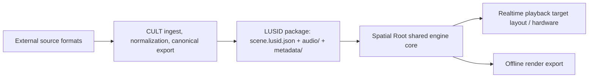

```mermaid
flowchart LR
    A[External source formats] --> B[CULT ingest, normalization, canonical export]
    B --> C[LUSID package: scene.lusid.json + audio/ + metadata/]
    C --> D[Spatial Root shared engine core]
    D --> E[Realtime playback target layout / hardware]
    D --> F[Offline render export]
```