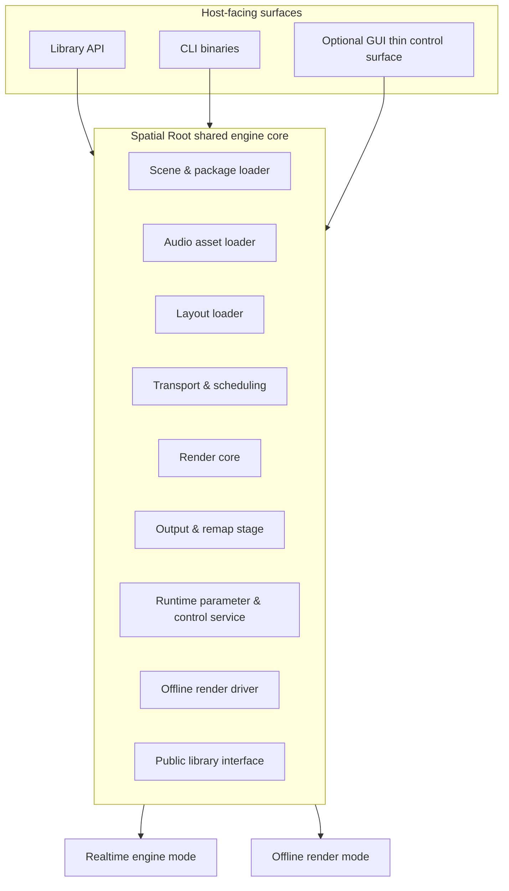

```mermaid
flowchart TB
    subgraph Hosts[Host-facing surfaces]
        API[Library API]
        CLI[CLI binaries]
        GUI[Optional GUI thin control surface]
    end

    API --> CORE
    CLI --> CORE
    GUI --> CORE

    subgraph CORE[Spatial Root shared engine core]
        L1[Scene & package loader]
        L2[Audio asset loader]
        L3[Layout loader]
        T[Transport & scheduling]
        R[Render core]
        O[Output & remap stage]
        C[Runtime parameter & control service]
        OFF[Offline render driver]
        PUB[Public library interface]
    end

    CORE --> RT[Realtime engine mode]
    CORE --> OR[Offline render mode]
```