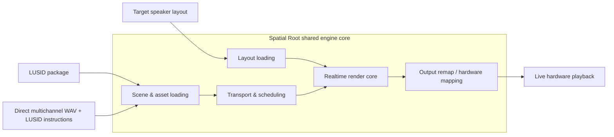

```mermaid
flowchart LR
    IN1[LUSID package] --> LOAD
    IN2[Direct multichannel WAV + LUSID instructions] --> LOAD
    IN3[Target speaker layout] --> LAYOUT

    subgraph SR[Spatial Root shared engine core]
        LOAD[Scene & asset loading]
        LAYOUT[Layout loading]
        TS[Transport & scheduling]
        RENDER[Realtime render core]
        MAP[Output remap / hardware mapping]
    end

    LOAD --> TS
    LAYOUT --> RENDER
    TS --> RENDER
    RENDER --> MAP
    MAP --> OUT[Live hardware playback]
```