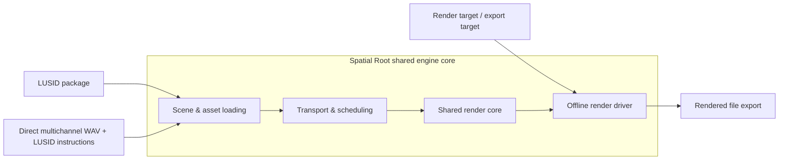

```mermaid
flowchart LR
    IN1[LUSID package] --> LOAD
    IN2[Direct multichannel WAV + LUSID instructions] --> LOAD
    IN3[Render target / export target] --> DRIVER

    subgraph SR[Spatial Root shared engine core]
        LOAD[Scene & asset loading]
        TS[Transport & scheduling]
        RENDER[Shared render core]
        DRIVER[Offline render driver]
    end

    LOAD --> TS
    TS --> RENDER
    RENDER --> DRIVER
    DRIVER --> FILE[Rendered file export]
```