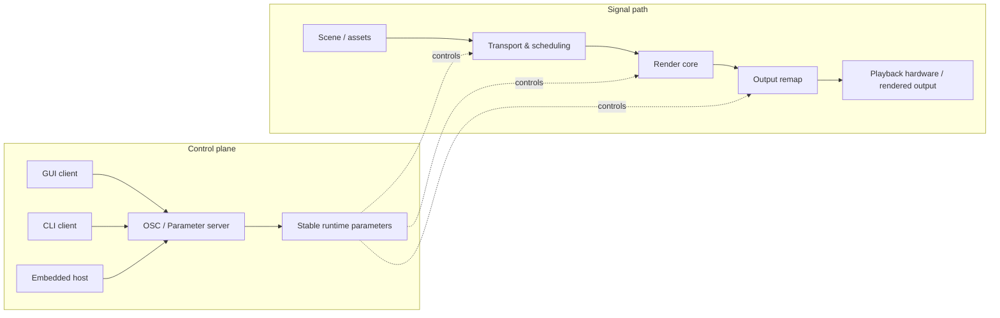

```mermaid
flowchart LR
    subgraph SignalPath[Signal path]
        S1[Scene / assets] --> S2[Transport & scheduling]
        S2 --> S3[Render core]
        S3 --> S4[Output remap]
        S4 --> S5[Playback hardware / rendered output]
    end

    subgraph ControlPlane[Control plane]
        GUI[GUI client]
        CLI[CLI client]
        HOST[Embedded host]
        OSC[OSC / Parameter server]
        PARAMS[Stable runtime parameters]
    end

    GUI --> OSC
    CLI --> OSC
    HOST --> OSC
    OSC --> PARAMS
    PARAMS -.controls.-> S2
    PARAMS -.controls.-> S3
    PARAMS -.controls.-> S4
```