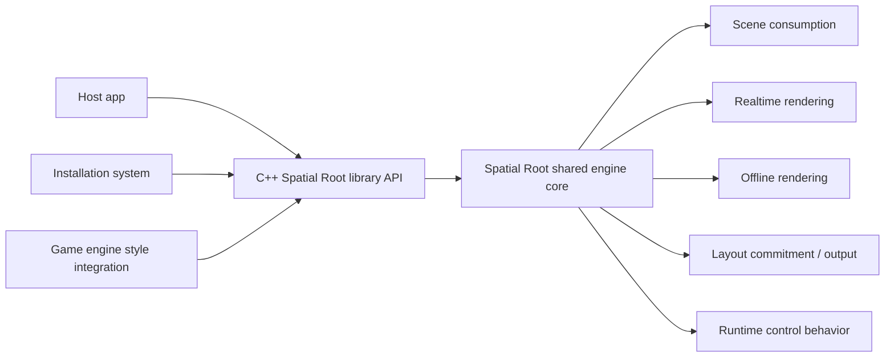

```mermaid
flowchart LR
    H1[Host app]
    H2[Installation system]
    H3[Game engine style integration]

    H1 --> API[C++ Spatial Root library API]
    H2 --> API
    H3 --> API

    API --> CORE[Spatial Root shared engine core]

    CORE --> SCENE[Scene consumption]
    CORE --> RT[Realtime rendering]
    CORE --> OFF[Offline rendering]
    CORE --> OUT[Layout commitment / output]
    CORE --> CTRL[Runtime control behavior]
```