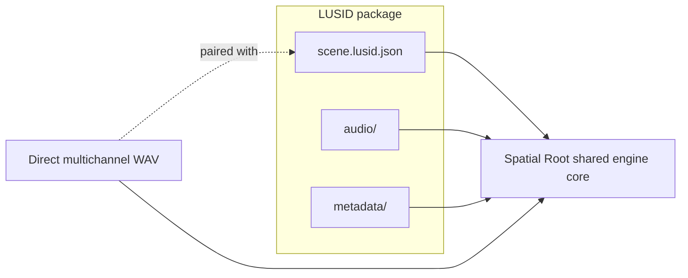

```mermaid
flowchart LR
    subgraph CanonicalInput[LUSID package]
        SCENE[scene.lusid.json]
        AUDIO[audio/]
        META[metadata/]
    end

    SCENE --> SR[Spatial Root shared engine core]
    AUDIO --> SR
    META --> SR

    WAV[Direct multichannel WAV] --> SR
    WAV -.paired with.-> SCENE
```