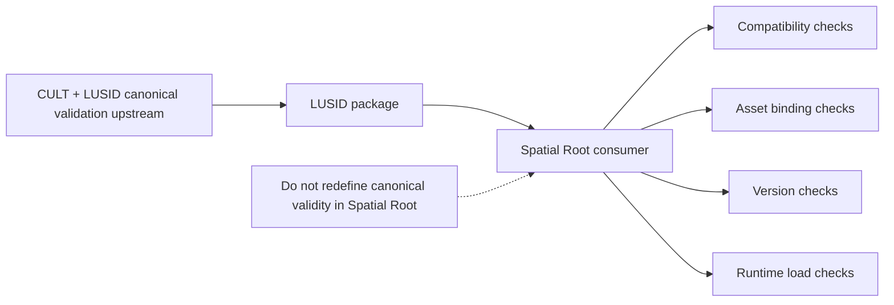

```mermaid
flowchart LR
    CULT[CULT + LUSID canonical validation upstream] --> PKG[LUSID package]
    PKG --> SR[Spatial Root consumer]

    SR --> C1[Compatibility checks]
    SR --> C2[Asset binding checks]
    SR --> C3[Version checks]
    SR --> C4[Runtime load checks]

    NOTE[Do not redefine canonical validity in Spatial Root]
    NOTE -.-> SR
```