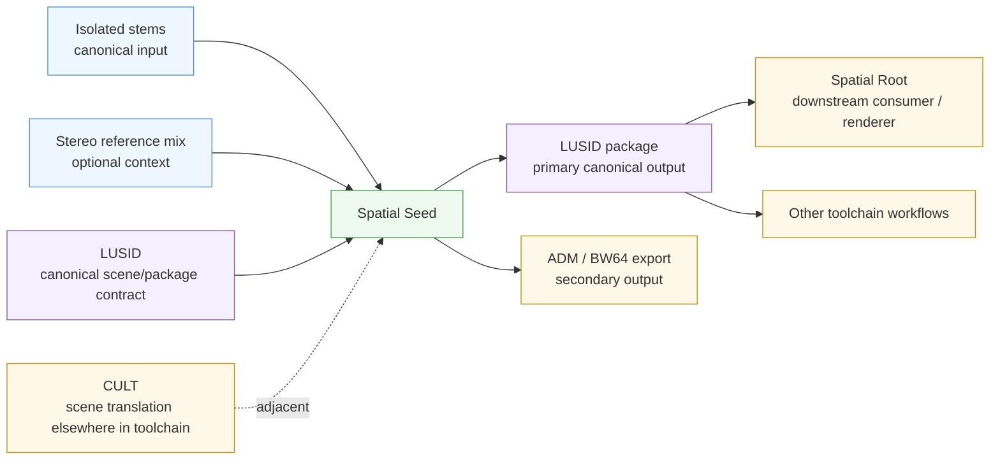

# System Context

```mermaid
flowchart LR
    A[Isolated stems<br/>canonical input] --> B[Spatial Seed]
    X[Stereo reference mix<br/>optional context] --> B

    B --> C[LUSID package<br/>primary canonical output]
    B --> D[ADM / BW64 export<br/>secondary output]

    C --> E[Spatial Root<br/>downstream consumer / renderer]
    C --> F[Other toolchain workflows]
    G[LUSID<br/>canonical scene/package contract] --> B
    H[CULT<br/>scene translation elsewhere in toolchain] -.adjacent.-> B

    classDef src fill:#eef7ff,stroke:#4a90e2,stroke-width:1px;
    classDef core fill:#eefaf0,stroke:#43a047,stroke-width:1px;
    classDef canon fill:#f5f0ff,stroke:#7e57c2,stroke-width:1px;
    classDef out fill:#fff8e8,stroke:#c49000,stroke-width:1px;

    class A,X src;
    class B core;
    class C,G canon;
    class D,E,F,H out;
```
