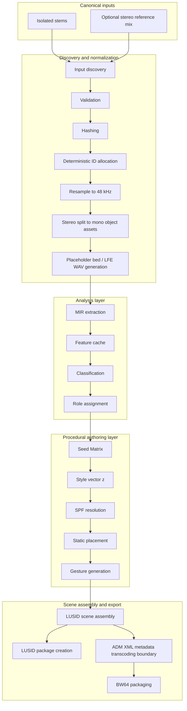

# Core Systems Architecture

```mermaid
flowchart TB
    subgraph Inputs[Canonical inputs]
        I1[Isolated stems]
        I2[Optional stereo reference mix]
    end

    subgraph Preprocess[Discovery and normalization]
        P1[Input discovery]
        P2[Validation]
        P3[Hashing]
        P4[Deterministic ID allocation]
        P5[Resample to 48 kHz]
        P6[Stereo split to mono object assets]
        P7[Placeholder bed / LFE WAV generation]
    end

    subgraph Analysis[Analysis layer]
        A1[MIR extraction]
        A2[Feature cache]
        A3[Classification]
        A4[Role assignment]
    end

    subgraph Procedural[Procedural authoring layer]
        M1[Seed Matrix]
        M2[Style vector z]
        M3[SPF resolution]
        M4[Static placement]
        M5[Gesture generation]
    end

    subgraph Assembly[Scene assembly and export]
        S1[LUSID scene assembly]
        S2[LUSID package creation]
        S3[ADM XML metadata transcoding boundary]
        S4[BW64 packaging]
    end

    I1 --> P1
    I2 --> P1
    P1 --> P2 --> P3 --> P4 --> P5 --> P6 --> P7
    P7 --> A1 --> A2 --> A3 --> A4
    A4 --> M1
    M1 --> M2 --> M3 --> M4 --> M5
    M5 --> S1 --> S2
    S1 --> S3 --> S4
```
