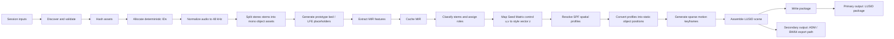

# Offline Authoring Data Flow

```mermaid
flowchart LR
    IN[Session inputs] --> D1[Discover and validate]
    D1 --> D2[Hash assets]
    D2 --> D3[Allocate deterministic IDs]
    D3 --> N1[Normalize audio to 48 kHz]
    N1 --> N2[Split stereo stems into mono object assets]
    N2 --> N3[Generate prototype bed / LFE placeholders]
    N3 --> A1[Extract MIR features]
    A1 --> A2[Cache MIR]
    A2 --> C1[Classify stems and assign roles]
    C1 --> S1[Map Seed Matrix control u,v to style vector z]
    S1 --> S2[Resolve SPF spatial profiles]
    S2 --> P1[Convert profiles into static object positions]
    P1 --> G1[Generate sparse motion keyframes]
    G1 --> L1[Assemble LUSID scene]
    L1 --> L2[Write package]
    L2 --> O1[Primary output: LUSID package]
    L1 --> O2[Secondary output: ADM / BW64 export path]
```
