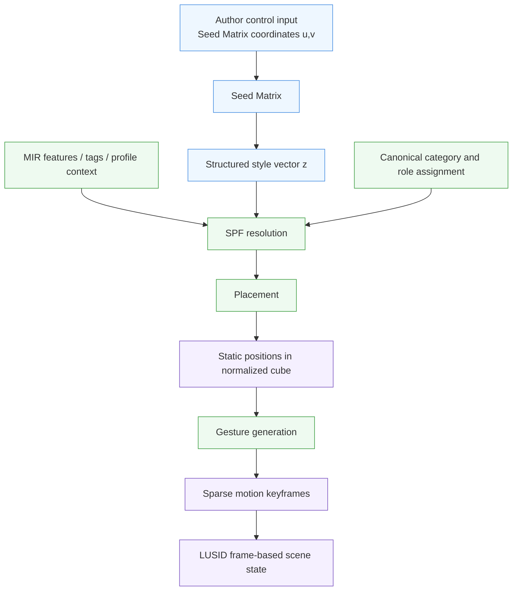
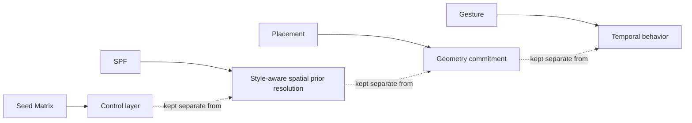

# Procedural Module Flow

```mermaid
flowchart TB
    U[Author control input<br/>Seed Matrix coordinates u,v] --> SM[Seed Matrix]
    SM --> Z[Structured style vector z]

    MIR[MIR features / tags / profile context] --> SPF[SPF resolution]
    Z --> SPF
    CLS[Canonical category and role assignment] --> SPF

    SPF --> PLACE[Placement]
    PLACE --> POS[Static positions in normalized cube]

    POS --> GEST[Gesture generation]
    GEST --> KF[Sparse motion keyframes]
    KF --> SCENE[LUSID frame-based scene state]

    classDef ctl fill:#eef7ff,stroke:#4a90e2,stroke-width:1px;
    classDef proc fill:#eefaf0,stroke:#43a047,stroke-width:1px;
    classDef out fill:#f5f0ff,stroke:#7e57c2,stroke-width:1px;

    class U,SM,Z ctl;
    class MIR,CLS,SPF,PLACE,GEST proc;
    class POS,KF,SCENE out;
```

```mermaid
flowchart LR
    A[Seed Matrix] --> B[Control layer]
    C[SPF] --> D[Style-aware spatial prior resolution]
    E[Placement] --> F[Geometry commitment]
    G[Gesture] --> H[Temporal behavior]

    B -.kept separate from.-> D
    D -.kept separate from.-> F
    F -.kept separate from.-> H
```
