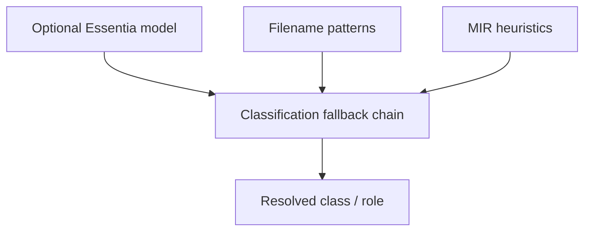

# Input Normalization and Analysis

```mermaid
flowchart LR
    STEMS[Input stems] --> V[Validate]
    V --> H[Hash]
    H --> ID[Deterministic object IDs<br/>begin at group 11]
    ID --> R[Resample to 48 kHz]
    R --> SPLIT[Stereo to mono object split]
    SPLIT --> FLOAT[Keep float32 / no gain normalization in v1]
    FLOAT --> MIR[MIR extraction]
    MIR --> CACHE[Feature cache]
    CACHE --> CLASS[Classification fallback chain]
    CLASS --> ROLES[Canonical category / role assignment]
```

```mermaid
flowchart TB
    C1[Optional Essentia model] --> F[Classification fallback chain]
    C2[Filename patterns] --> F
    C3[MIR heuristics] --> F
    F --> OUT[Resolved class / role]
```
