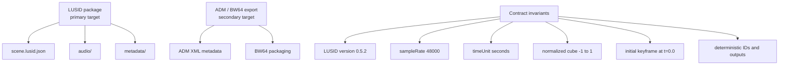

# Output Contracts and Boundaries

```mermaid
flowchart LR
    subgraph SpatialSeed[Spatial Seed owns]
        S1[Discovery]
        S2[Normalization]
        S3[Stereo split]
        S4[MIR extraction and caching]
        S5[Classification and role assignment]
        S6[Seed Matrix mapping]
        S7[SPF resolution]
        S8[Placement]
        S9[Gesture generation]
        S10[LUSID package creation]
        S11[BW64 packaging for ADM export]
    end

    subgraph LUSID[LUSID owns]
        L1[Schema / versioning]
        L2[Canonical package contract]
        L3[LUSID to ADM XML metadata transcoding]
    end

    subgraph Downstream[Spatial Seed does not own]
        D1[Final rendering]
        D2[Speaker-layout commitment]
        D3[Bass-management policy]
        D4[Venue-specific output behavior]
        D5[Realtime playback]
    end

    SpatialSeed --> LUSID --> Downstream
```

```mermaid
flowchart TB
    C1[LUSID package<br/>primary target] --> P1[scene.lusid.json]
    C1 --> P2[audio/]
    C1 --> P3[metadata/]

    C2[ADM / BW64 export<br/>secondary target] --> A1[ADM XML metadata]
    C2 --> A2[BW64 packaging]

    INV[Contract invariants] --> I1[LUSID version 0.5.2]
    INV --> I2[sampleRate 48000]
    INV --> I3[timeUnit seconds]
    INV --> I4[normalized cube -1 to 1]
    INV --> I5[initial keyframe at t=0.0]
    INV --> I6[deterministic IDs and outputs]
```
