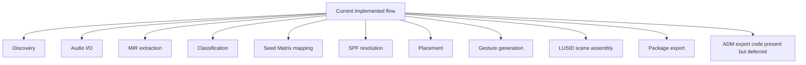
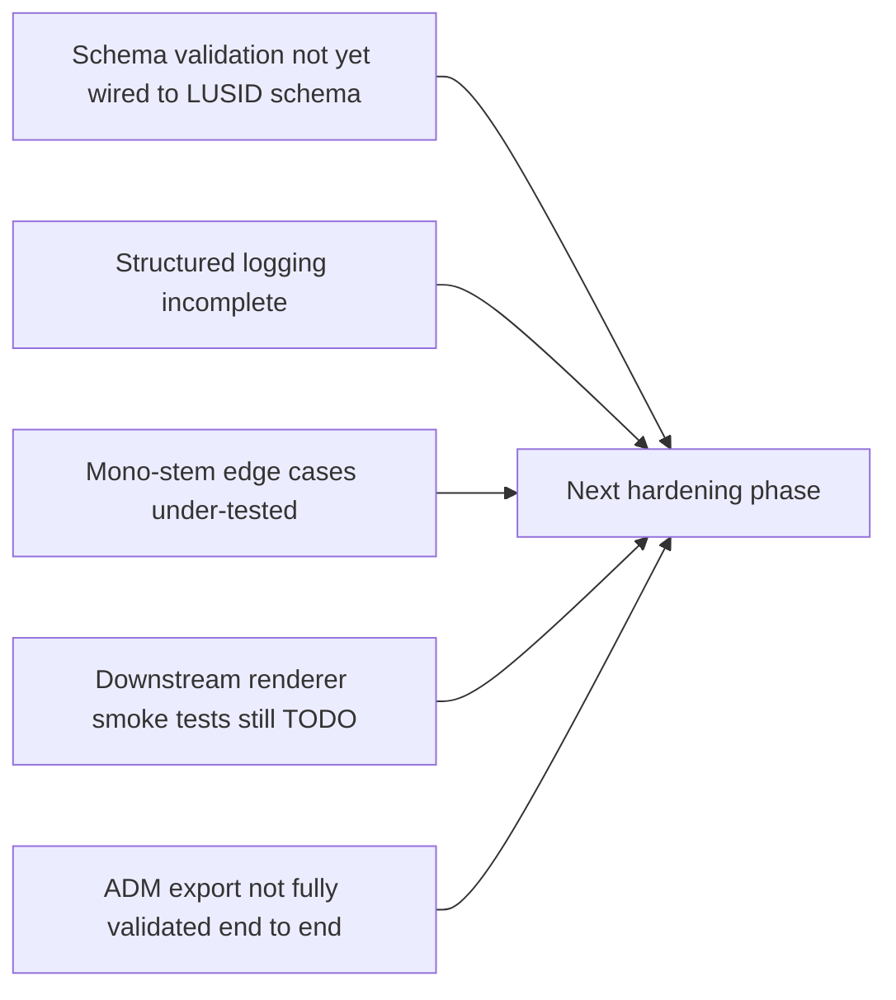
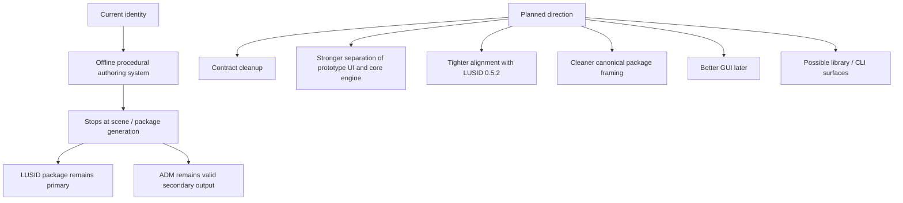

# Validation, Gaps, and Roadmap

```mermaid
flowchart TB
    CUR[Current implemented flow] --> C1[Discovery]
    CUR --> C2[Audio I/O]
    CUR --> C3[MIR extraction]
    CUR --> C4[Classification]
    CUR --> C5[Seed Matrix mapping]
    CUR --> C6[SPF resolution]
    CUR --> C7[Placement]
    CUR --> C8[Gesture generation]
    CUR --> C9[LUSID scene assembly]
    CUR --> C10[Package export]
    CUR --> C11[ADM export code present but deferred]
```

```mermaid
flowchart LR
    G1[Schema validation not yet wired to LUSID schema]
    G2[Structured logging incomplete]
    G3[Mono-stem edge cases under-tested]
    G4[Downstream renderer smoke tests still TODO]
    G5[ADM export not fully validated end to end]

    G1 --> NEXT[Next hardening phase]
    G2 --> NEXT
    G3 --> NEXT
    G4 --> NEXT
    G5 --> NEXT
```

```mermaid
flowchart TB
    NOW[Current identity] --> A[Offline procedural authoring system]
    A --> B[Stops at scene / package generation]
    B --> C[LUSID package remains primary]
    B --> D[ADM remains valid secondary output]

    FUT[Planned direction] --> F1[Contract cleanup]
    FUT --> F2[Stronger separation of prototype UI and core engine]
    FUT --> F3[Tighter alignment with LUSID 0.5.2]
    FUT --> F4[Cleaner canonical package framing]
    FUT --> F5[Better GUI later]
    FUT --> F6[Possible library / CLI surfaces]
```
